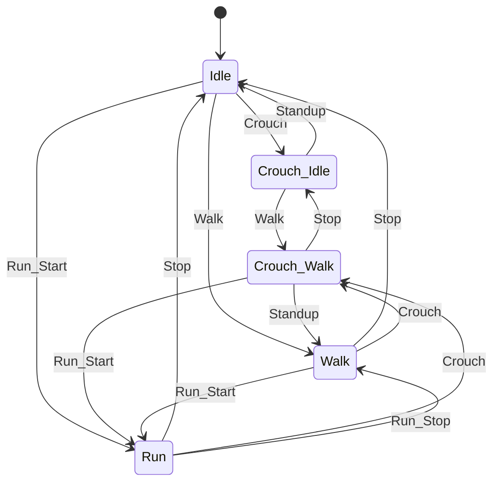
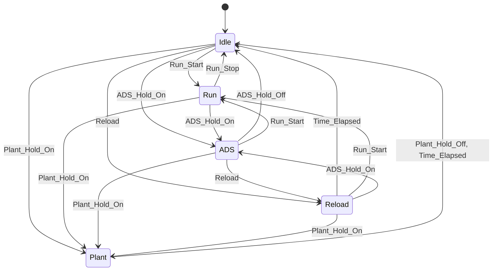

## Lower Body Half

```mermaid
stateDiagram-v2
    [*] --> Idle

    Idle --> Crouch_Idle: Crouch
    Idle --> Walk: Walk
    Idle --> Run: Run_Start

    Crouch_Idle --> Idle: Standup
    Crouch_Idle --> Crouch_Walk: Walk
    
    Crouch_Walk --> Crouch_Idle: Stop
    Crouch_Walk --> Walk: Standup
    Crouch_Walk --> Run: Run_Start

    Walk --> Idle: Stop
    Walk --> Crouch_Walk: Crouch
    Walk --> Run: Run_Start

    Run --> Idle: Stop
    Run --> Crouch_Walk: Crouch
    Run --> Walk: Run_Stop
```

## Upper Body Half

```mermaid
stateDiagram-v2
    [*] --> Idle

    Idle --> Run: Run_Start
    Idle --> ADS: ADS_Hold_On
    Idle --> Reload: Reload
    Idle --> Plant: Plant_Hold_On

    Run --> Idle: Run_Stop
    Run --> ADS: ADS_Hold_On
    Run --> Plant: Plant_Hold_On

    ADS --> Idle: ADS_Hold_Off
    ADS --> Run: Run_Start
    ADS --> Reload: Reload
    ADS --> Plant: Plant_Hold_On

    Reload --> Idle: Time_Elapsed
    Reload --> Run: Run_Start
    Reload --> ADS: ADS_Hold_On
    Reload --> Plant: Plant_Hold_On

    Plant --> Idle: Plant_Hold_Off, Time_Elapsed
```