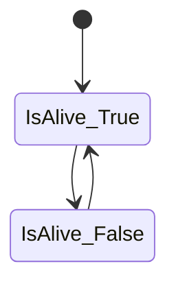
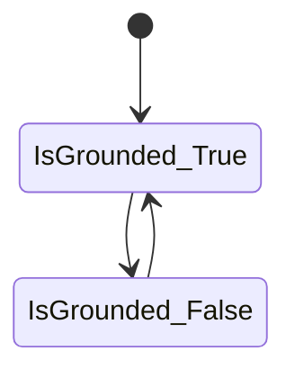
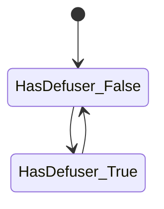

```mermaid
stateDiagram-v2
[*] --> IsAlive_True

IsAlive_True --> IsAlive_False

IsAlive_False --> IsAlive_True
```

```mermaid
stateDiagram-v2
[*] --> IsGrounded_True

IsGrounded_True --> IsGrounded_False

IsGrounded_False --> IsGrounded_True
```

```mermaid
stateDiagram-v2
[*] --> HasDefuser_False

HasDefuser_False --> HasDefuser_True

HasDefuser_True --> HasDefuser_False
```