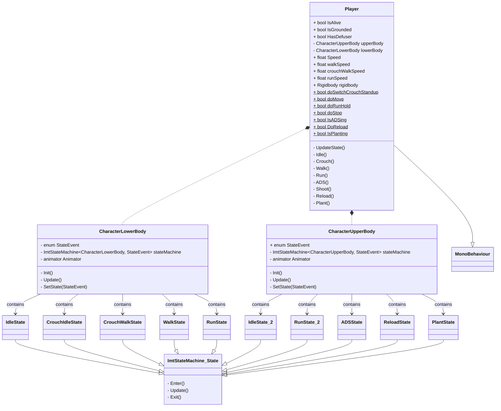

```mermaid
classDiagram
    Player *.. CharacterUpperBody
    Player *.. CharacterLowerBody

    Player --|> MonoBehaviour
    class Player{
        + bool IsAlive
        + bool IsGrounded
        + bool HasDefuser

        - CharacterUpperBody upperBody
        - CharacterLowerBody lowerBody

        + float Speed
        + float walkSpeed
        + float crouchWalkSpeed
        + float runSpeed

        + Rigidbody rigidbody

        + bool doSwitchCrouchStandup$
        + bool doMove$
        + bool doRunHold$
        + bool doStop$
        + bool IsADSing$
        + bool DoReload$
        + bool IsPlanting$

        - UpdateState()

        - Idle()
        - Crouch()
        - Walk()
        - Run()
        - ADS()
        - Shoot()
        - Reload()
        - Plant()
    }
    
    class CharacterLowerBody{
        - enum StateEvent
        - ImtStateMachine~CharacterLowerBody, StateEvent~ stateMachine

        - animator Animator

        - Init()
        - Update()
        
        - SetState(StateEvent)
    }

    CharacterLowerBody --> IdleState: contains
    CharacterLowerBody --> CrouchIdleState: contains
    CharacterLowerBody --> CrouchWalkState: contains
    CharacterLowerBody --> WalkState: contains
    CharacterLowerBody --> RunState: contains

    class ImtStateMachine_State{
        - Enter()
        - Update()
        - Exit()
    }
    IdleState --|> ImtStateMachine_State
    CrouchIdleState --|> ImtStateMachine_State
    CrouchWalkState--|> ImtStateMachine_State
    WalkState --|> ImtStateMachine_State
    RunState --|> ImtStateMachine_State

    class CharacterUpperBody{
        + enum StateEvent
        - ImtStateMachine~CharacterUpperBody, StateEvent~ stateMachine

        - animator Animator

        - Init()
        - Update()
        
        - SetState(StateEvent)
    }

    CharacterUpperBody --> IdleState_2: contains
    CharacterUpperBody --> RunState_2: contains
    CharacterUpperBody --> ADSState: contains
    CharacterUpperBody --> ReloadState: contains
    CharacterUpperBody --> PlantState: contains

    IdleState_2 --|> ImtStateMachine_State
    RunState_2 --|> ImtStateMachine_State
    ADSState --|> ImtStateMachine_State
    ReloadState --|> ImtStateMachine_State
    PlantState --|> ImtStateMachine_State

```