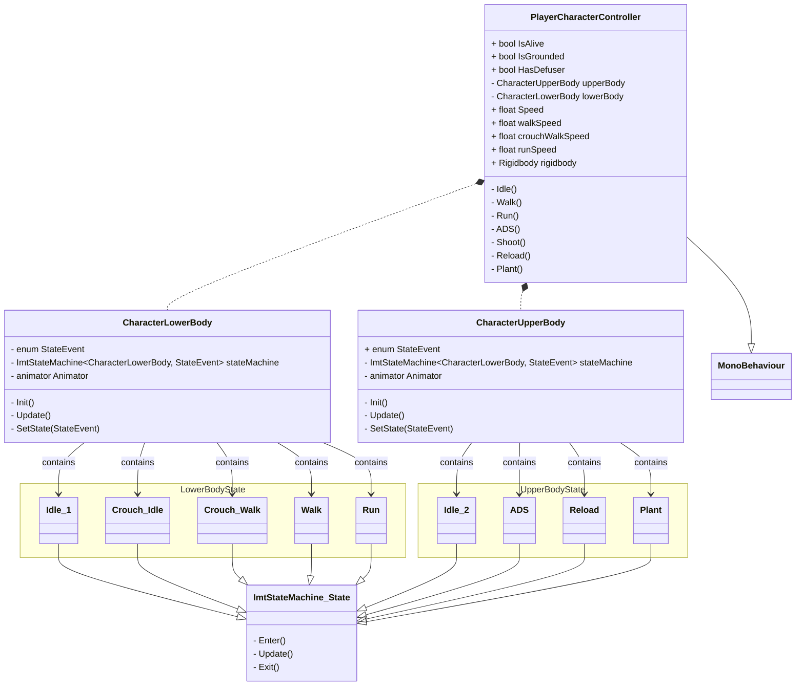

```mermaid
classDiagram
    PlayerCharacterController *.. CharacterUpperBody
    PlayerCharacterController *.. CharacterLowerBody

    PlayerCharacterController --|> MonoBehaviour
    class PlayerCharacterController{
        + bool IsAlive
        + bool IsGrounded
        + bool HasDefuser

        - CharacterUpperBody upperBody
        - CharacterLowerBody lowerBody

        + float Speed
        + float walkSpeed
        + float crouchWalkSpeed
        + float runSpeed

        + Rigidbody rigidbody

        - Idle()
        - Walk()
        - Run()
        - ADS()
        - Shoot()
        - Reload()
        - Plant()
    }
    
    class CharacterLowerBody{
        - enum StateEvent
        - ImtStateMachine~CharacterLowerBody, StateEvent~ stateMachine

        - animator Animator

        - Init()
        - Update()
        
        - SetState(StateEvent)
    }

    namespace LowerBodyState{
        class Idle_1
        class Crouch_Idle
        class Crouch_Walk
        class Walk
        class Run
    }

    CharacterLowerBody --> Idle_1: contains
    CharacterLowerBody --> Crouch_Idle: contains
    CharacterLowerBody --> Crouch_Walk: contains
    CharacterLowerBody --> Walk: contains
    CharacterLowerBody --> Run: contains

    class ImtStateMachine_State{
        - Enter()
        - Update()
        - Exit()
    }
    Idle_1 --|> ImtStateMachine_State
    Crouch_Idle --|> ImtStateMachine_State
    Crouch_Walk--|> ImtStateMachine_State
    Walk --|> ImtStateMachine_State
    Run --|> ImtStateMachine_State

    class CharacterUpperBody{
        + enum StateEvent
        - ImtStateMachine~CharacterLowerBody, StateEvent~ stateMachine

        - animator Animator

        - Init()
        - Update()
        
        - SetState(StateEvent)
    }

    namespace UpperBodyState{
        class Idle_2
        class ADS
        class Reload
        class Plant
    }

    CharacterUpperBody --> Idle_2: contains
    CharacterUpperBody --> ADS: contains
    CharacterUpperBody --> Reload: contains
    CharacterUpperBody --> Plant: contains

    Idle_2 --|> ImtStateMachine_State
    ADS --|> ImtStateMachine_State
    Reload --|> ImtStateMachine_State
    Plant --|> ImtStateMachine_State

```